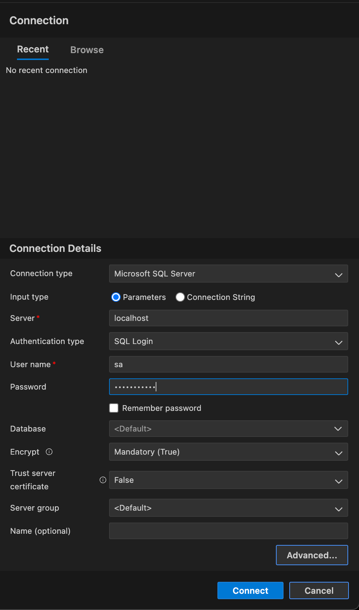
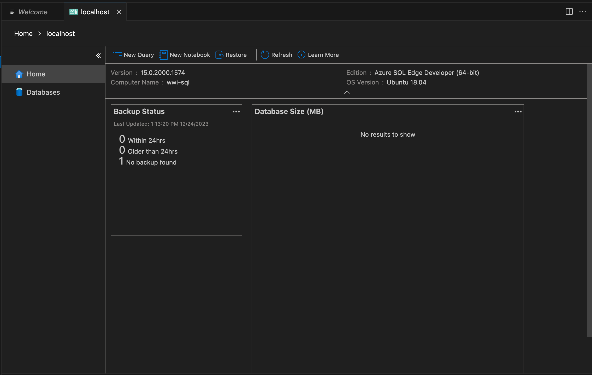
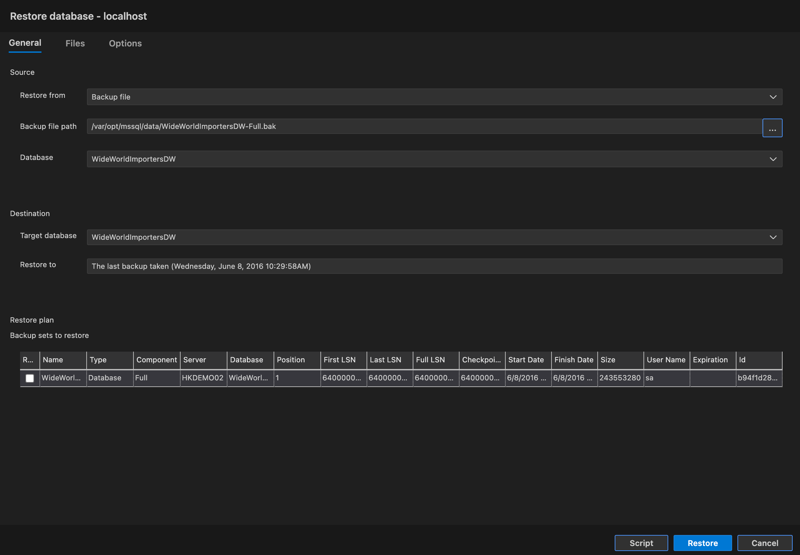

# Creating dashboard for the worldwide importers dataset in Apache Superset

## Pre-requisites
- [Docker](https://www.docker.com/products/docker-desktop)
- [Azure Data Studio](https://docs.microsoft.com/en-us/sql/azure-data-studio/download-azure-data-studio?view=sql-server-ver15)
- [Worldwide Importers sample database](https://github.com/Microsoft/sql-server-samples/releases/download/wide-world-importers-v1.0/WideWorldImportersDW-Full.bak)


## Setting up the SQL Server database
1. **Pull an Azure SQL Docker image** by running the following command in a terminal window:

    ```bash
   docker pull mcr.microsoft.com/azure-sql-edge:latest
    ```

    This command does the following:
    - `docker pull`: This command is used to fetch a Docker image from a registry. Docker images are lightweight, standalone, and executable packages that include everything needed to run a piece of software, including the code, a runtime, libraries, environment variables, and config files.
    - `mcr.microsoft.com/azure-sql-edge:latest`: This is the name of the Docker image to pull. The name is made up of the registry (`mcr.microsoft.com`), the repository (`azure-sql-edge`), and the tag (`latest`). The registry is the place where the Docker image is stored. The repository is the name of the Docker image, and the tag is the version of the Docker image. In this case, the `latest` tag is used to pull the most recent version of the `azure-sql-edge` Docker image from the `mcr.microsoft.com` registry.

2. **Start the Docker container** by running the following command in a terminal window:
    
    ```bash
    docker run -e "ACCEPT_EULA=Y" -e "SA_PASSWORD=Password123" -p 1433:1433 --name wwi-sql -h wwi-sql -d mcr.microsoft.com/azure-sql-edge:latest
    ```

    This command does the following:
    - `docker run`: This command is used to start a new Docker container.
    - `-e "ACCEPT_EULA=Y"`: This sets an environment variable in the container that accepts the End User License Agreement.
    - `-e "SA_PASSWORD=Password123"`: This sets an environment variable in the container that specifies the password for the SQL Server system administrator account.
    - `-p 1433:1433`: This maps the container's port 1433 to the host's port 1433. Port 1433 is the default port for SQL Server.
    - `--name wwi-sql`: This assigns the name "wwi-sql" to the container.
    - `-h wwi-sql`: This sets the hostname of the container to "wwi-sql".
    - `-d mcr.microsoft.com/azure-sql-edge:latest`: This specifies the Docker image to use, which in this case is the latest version of the Azure SQL Edge image.


3. **Copy the Worldwide Importers database backup file** to the Docker container by running the following command in a terminal window:

    ```bash
    docker cp ~/Downloads/WideWorldImportersDW-Full.bak wwi-sql:/var/opt/mssql/data/
    ```

    This command does the following:
    - `docker cp`: This command is used to copy files and folders between a container and the local filesystem.
    - `~/Downloads/WideWorldImportersDW-Full.bak`: This is the path to the Worldwide Importers database backup file on the local filesystem.
    - `wwi-sql:/var/opt/mssql/data/`: This is the path to the folder where the backup file should be copied in the container. The path is made up of the container name (`wwi-sql`), the folder (`/var/opt/mssql/data/`), and the filename (`WideWorldImportersDW-Full.bak`).

4. **Restore the Worldwide Importers database** by using the Azure Data Studio Restore Database wizard:
    - Open Azure Data Studio.
    - In the **Connections** pane add a new connection to the SQL Server instance running in the Docker container. Use the following settings:
        - **Server name**: `localhost`
        - **Authentication type**: `SQL Login`
        - **User name**: `sa`
        - **Password**: `Password123`
        
        

    - Click **Connect**. A dialog appears showing an Connection Error. Click `Trust Server Certificate` to continue.
    - In the **Object Explorer** pane, right-click on the server (`localhost`) and select **Manage** then select **Restore**.
    
        

    - On the **General** tab, fill in the values listed under **Source**. Under **Restore from**, select **Backup file**. Under **Backup file path**, select the location you stored the WideWorldImportersDW-Full.bak file. This auto-populates the rest of the fields such as **Database**, **Target database** and **Restore to**.
    - Finally, click **Restore** to restore the database.
    
        


